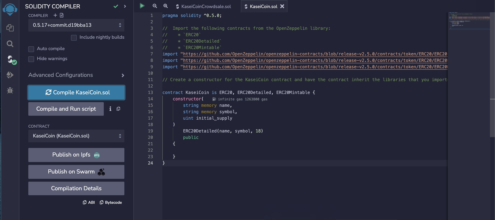
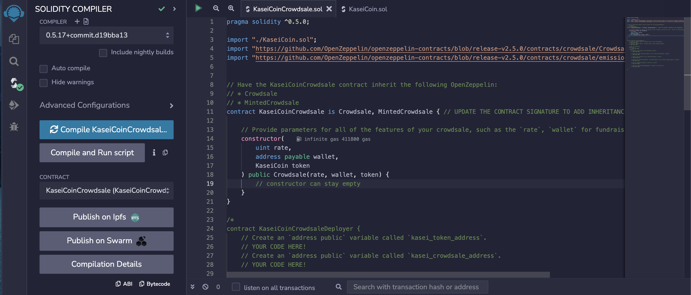
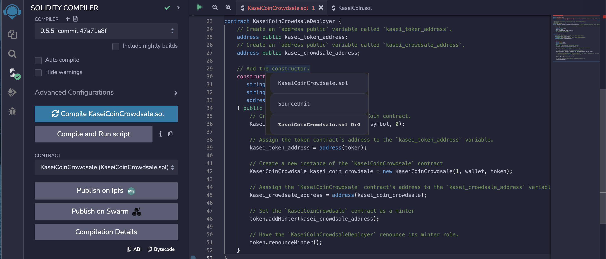
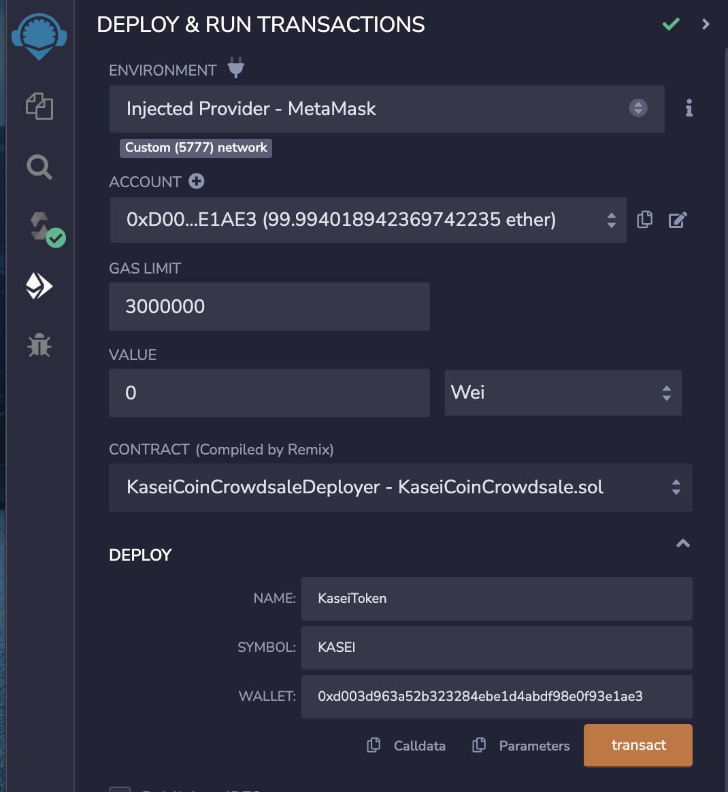
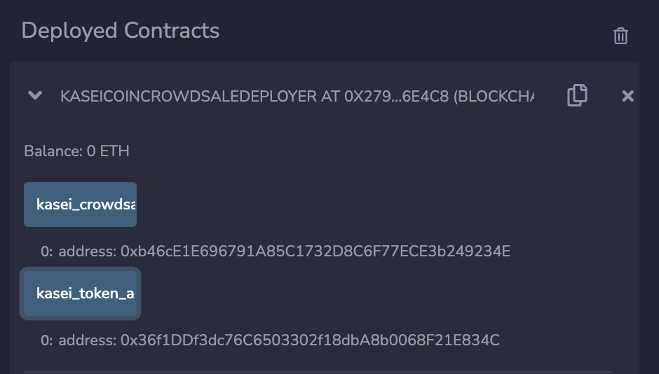
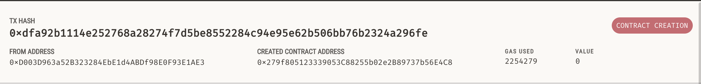
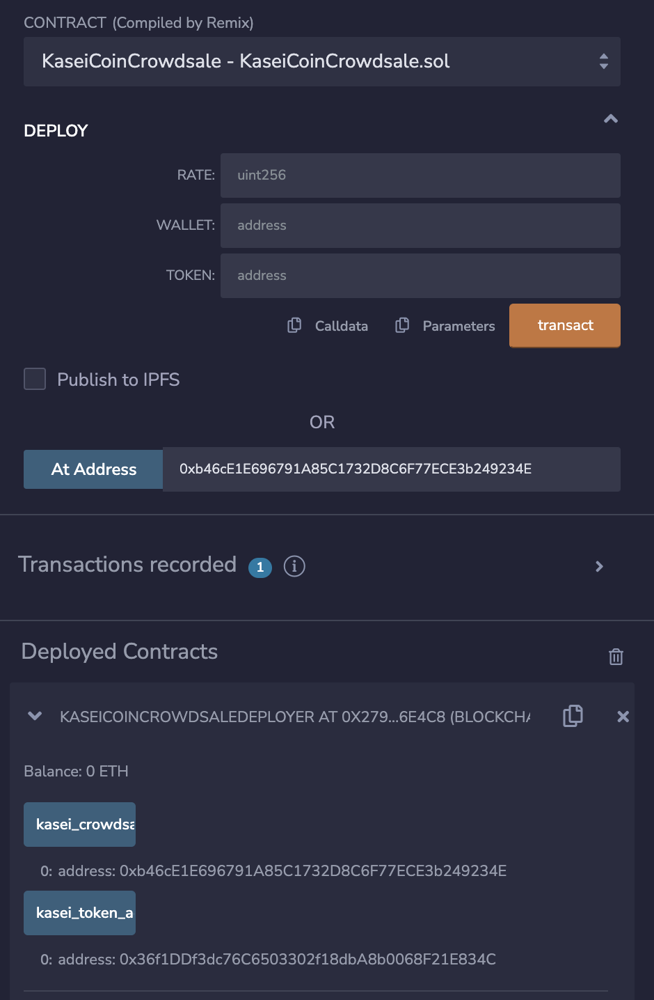
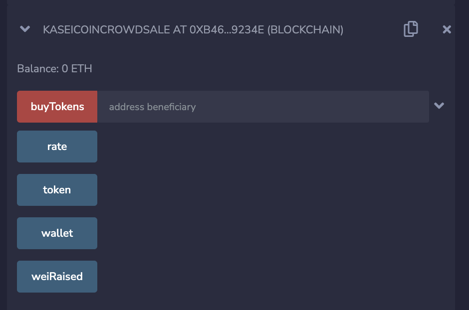
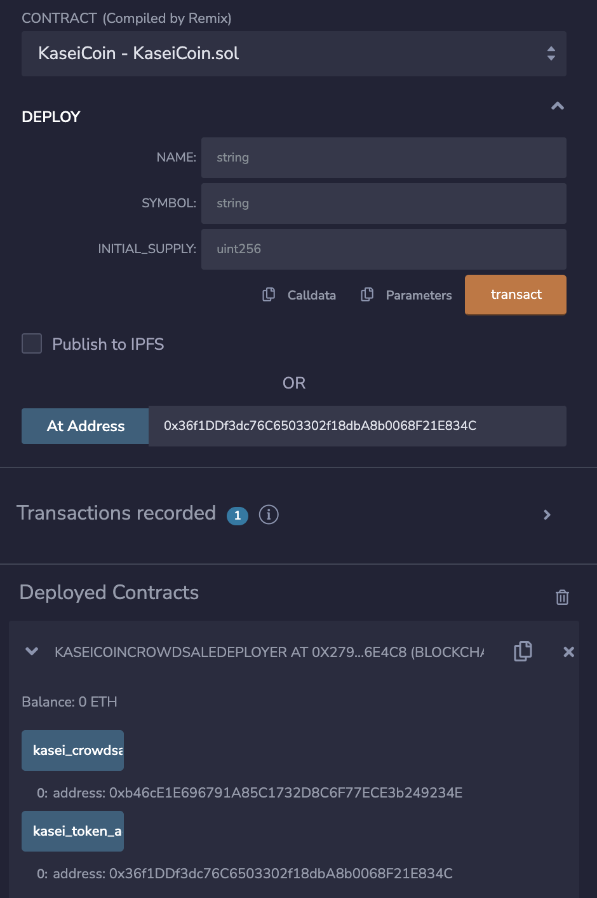
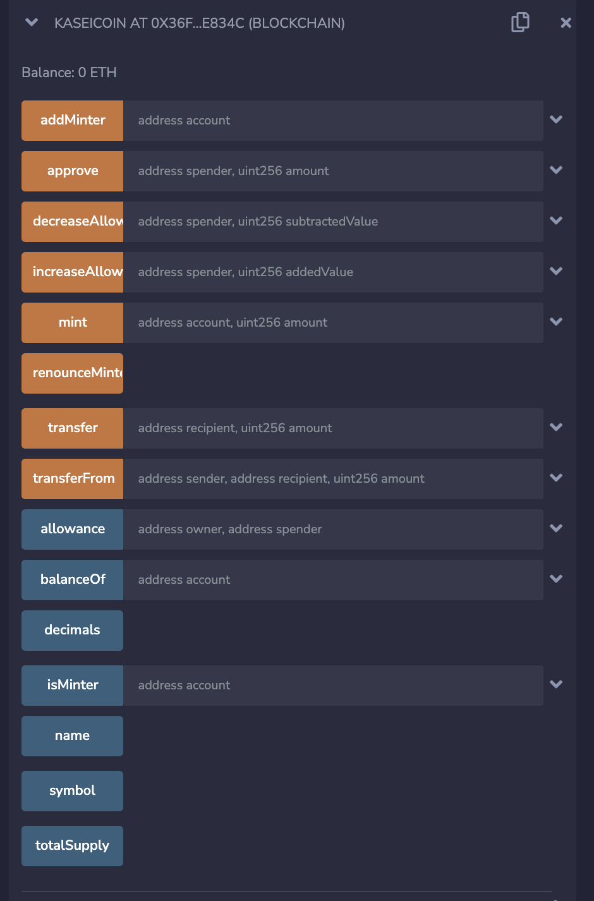

# Module_21

## **Task**
You will create a fungible token that is ERC-20 compliant and that will be minted by using a 'Crowdsale' contract from the OpenZeppelin Solidity library.

The crowdsale contract that you create will manage the entire crowdsale process, allowing users to send ether to the contract and in return receive KAI, or KaseiCoin tokens.

## **Evaluation Evidence**

Sucessful Compilation of the 'KaseiCoin' contract

Successful Compilation of the 'KaseiCoinCrowdsale' contract

Successful Compilation of the 'KaseiCoin deployer' contract

## **Deploy the Crowdsale to a Local Blockchain**

## Screenshots Included

